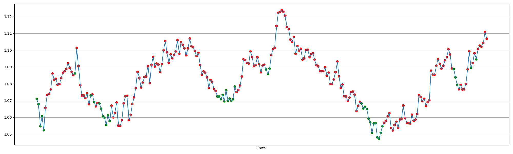

# Raport - etap 3 - 08.03.24

## Co udało się zrobić
1. Podniesienie wymiarowości problemu do 210.
2. Zaimplementowanie algorymtu decyzjnego
3. Benchamark algorytmu decyzyjnego i cma-es bez metaoptymalizacij

## Postęp prac

### Metryki

Zdecydowaliśmy się na użycie następujących podstawowych metryk:
- close cost
- SMA - Simple Moving Average
- RSI - Relative Strength Index
- SMM - Simple Moving Momentum
- EMA - Exponential Moving Average
- MOM - Market Momentum
- ROC - Rate of Change
- CCI - Commodity Channel Index
- ATR - Average True Range
- ADX - Average Directional Index
- STOCH - Stochastic Oscillator
- WILLIAMS - Williams %R
- OBV - On Balance Volume
- TRIX - Triple Exponential Average

A następnie dodaliśmy pochodne metryki będące ilocznem dwóch metryk podstawowych.
W ten sposób udało nam się zwiększyć wymiarowośc problemu do 210 wymiarów.

### Funkcja kosztu

Algorytm podejmuje decyzje o zakupie lub sprzedaży akcji na podstawie
iloczynu skalarnego wektora metryk i wektora wag. Ilość akcji jest oczywiście ograniczona
przez dostępne środki. Ponadto aby bardziej urealnić problem, dodaliśmy koszt transakcji będący procentem od kosztu całej transakcji.

### Metaoptymalizacji

Ponadto wybraliśmy kilka parametrów algorytmu cma-es, które chcielibyśmy zoptymalizować. Są to:
- CMA_active_injected - weight multiplier for negative weights of injected solutions
- CMA_cmean - learning rate for the mean value
- CMA_on - multiplier for all covariance matrix updates
- CMA_rankmu - multiplier for rank-mu update
- CMA_rankone - multiplier for rank-one update
- CSA_dampfac - positive multiplier for step-size damping, 0.3 is close to optimal on the sphere
- popsize - population size, AKA lambda, int(popsize) is the number of new solution per iteration
- tolfun - termination criterion: tolerance in function value
- sigma0 - std deviation

### Wyniki

Zwiększenie wymiarowości problemu zdecydowanie poprawiło uzyskiwane wyniki, wydłużło także czas obliczeń.
Obecnie jedno "puszczenie" cma-es trwa około 30-40 minut. Wyniki natomiast są bardzo zadwolające, dla kursu dolara do euro
w roku 2023 przy *fee*=1% udało nam się uzyskać zysk na poziomie 11% co jest bardzo dobrym wynikiem.

Tutaj możemy zaobserować w akcji jedno z zoptymalizowanych rowiązań:



Kolor czerwony oznacza sprzedanie części akcji, kolor zielony oznacza kupno części akcji. Jak widać algorytm kupuje akcje
w minimach lokalnych a więc działa on dość dobrze. Zyska dla powyższego wykresu wynosił 8%.

### Kod funkcji kosztu

```python
def func(x, data, true_cost, budget=1_000_000, logger=None, fee=0.01):
    stocks = 0
    for index, row in data.iterrows():
        # amount of stock to buy is the dot product of the metrics and the genotype
        amount_to_buy = int(np.dot(row, x))
        if amount_to_buy < -stocks:
            amount_to_buy = -stocks

        sign = 1 if amount_to_buy > 0 else -1
        cost = amount_to_buy * true_cost[index] * (1 + fee * sign)
        if cost > budget:
            amount_to_buy = int(budget / true_cost[index])
            cost = amount_to_buy * true_cost[index]

        if logger:
            # log the date, current stocks, stocks after buying, budget, cost
            logger.logValue(
                index,
                {'stocks': stocks, 'budget': budget, 'bought_stocks': amount_to_buy,
                 'cost': true_cost[index],
                 'total_cost': cost, 'budget_after_trans': budget - cost, 'stocks_after_trans': stocks + amount_to_buy}
            )

        budget -= cost
        stocks += amount_to_buy

    # sell all stock with price from last date
    cost = stocks * true_cost.iloc[-1] * (1 - fee)
    if logger:
        logger.logValue(
            len(data),
            {'date': 'final-transaction', 'stocks': stocks, 'budget': budget, 'bought_stocks': -stocks,
             'cost': true_cost.iloc[-1],
             'total_cost': cost, 'budget_after_trans': budget + cost, 'stocks_after_trans': 0}
        )
    budget = budget + cost
    return -budget
```