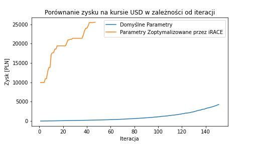
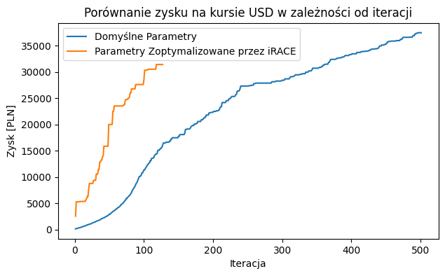

# Raport - etap 5 - 06.05.24

## Cache'owanie metryk
Okazało się, że obliczanie metryk zajmuje jedynie 0.03s. Postanowiliśmy więc ich nie cache'ować.

## Parametry CMA-ES
Dodaliśmy do konfiguracji nowy parametr i poprawiliśmy ograniczenia na parametry (czasami wybiegaliśmy poza ich dziedzinę).

## Metaoptymalizacja
Tym razem włączyliśmy dłuższy eksperyment w irace, z ograniczeniem liczby ewaluacji na 3000 w jednym przebiegu cma-es oraz 2000 uruchomień algorytmu przez irace. Obliczenia zajęły większą część nocy.

## Wykres zbieżności algorytmu dla parametrów domyślnych i zoptymalizowanych
Poniższy wykres reprezentuje porównanie przebiegów zysku w zależności od iteracji algorytmu dla parametrów domyślnych i zoptymalizowanych przez irace. Warto zauważyć, że w drugim przypadku iteracji było znacznie mniej, prawdopodobnie ze względu na większy rozmiar populacji. Przebieg algorytmu był ograniczony do 3000 ewaluacji.

Jak widać, zysk z domyślnymi parametrami jest nieznaczny względem tego ze zoptymalizowanymi. Przyspiesza on jednak wraz z iteracjami i nie widać by zbiegał do konkretnej wartości. Wyniki dla parametrów zoptymalizowanych są mniej przewidywalne. Występują w nich częste skoki zysku, a następnie wypłaszczenia na kilka iteracji.

Aby zobaczyć do jakiej wartości zbiega zysk z zoptymalizowanymi parametrami, przeprowadziliśmy dodatkowy eksperyment z 10000 ewaluacjami. Wyniki są następujące:

Jak widać zysk w przypadku zoptymalizowanch parametrów rośnie zdecydowanie szybciej, natomiast dość szybko się zatrzymuje, podczas gdy zysk z domyślnymi parametrami nadal rośnie. W tym drugim przypadku algorytm zatrzymuje się z na 10000 iteracji, natomiast w w przpadku irace-owych parametrów terminacja następuje z powodu:

> termination on tolfacupx=1000.0 (Mon May  6 09:43:01 2024)

Totalfacupx to według dokumetnacji:

> termination when step-size increases by tolfacupx (diverges). That is, the initial step-size was chosen far too small and better solutions were found far away from the initial solution x0

Zatem irace świetnie sobie poradził w swoim zadaniu, przy ograniczeniu na 3000 ewaluacji znalazł lesze parametry niż domyślne. Mimo to dla większej ilości ewaluacji domyślne parametry dalej są lepsze. Zatem należy przeprowadzić eksperyment z większa ilością ewaluacji. Problemem są natomiast ograniczenia sprzętowe, dla 3000 ewaluacji irace działał około 3-4h, ziwiększenie tej liczby do 10000 ewaluacji powinno wydłużyć ten czas do około 10-12h.