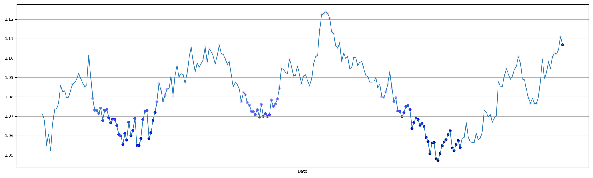
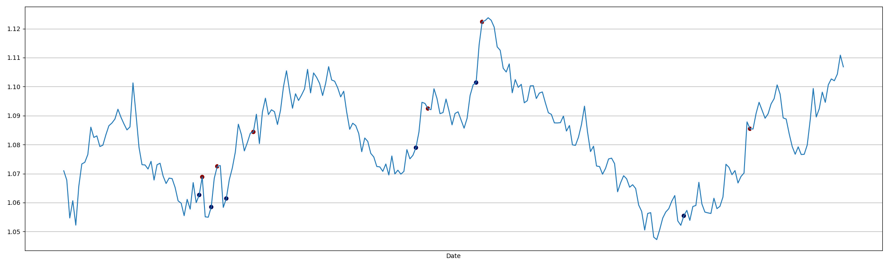
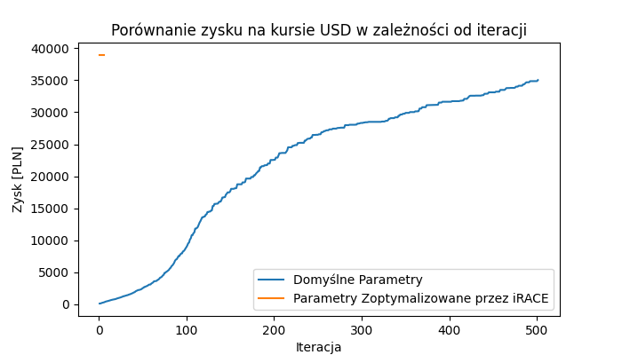
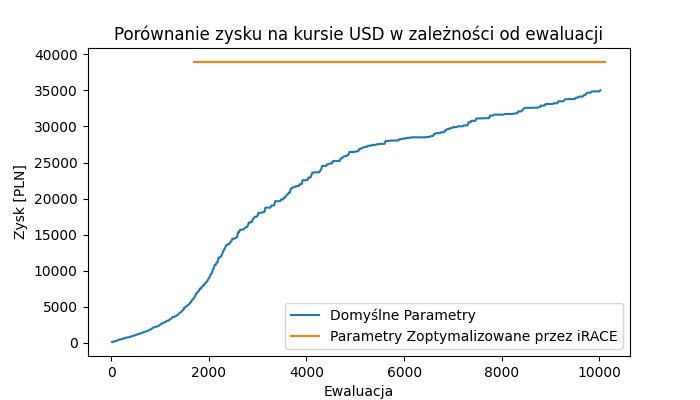
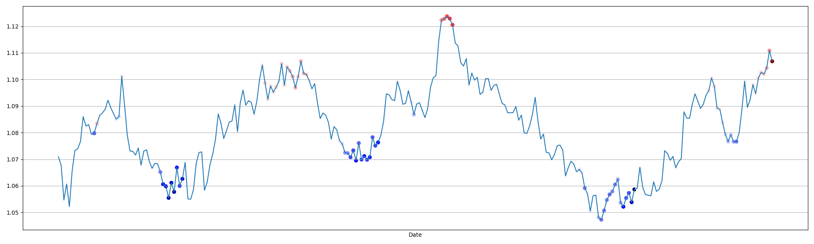
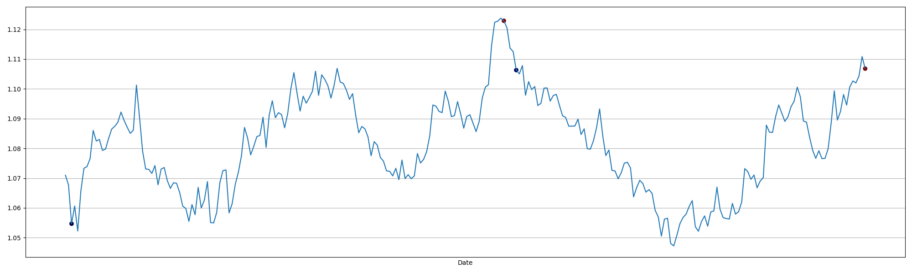
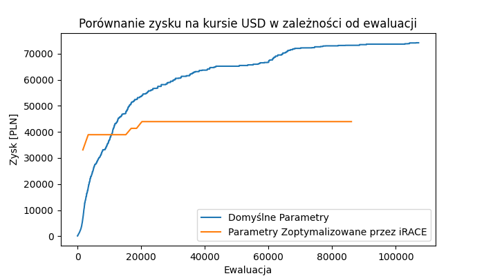
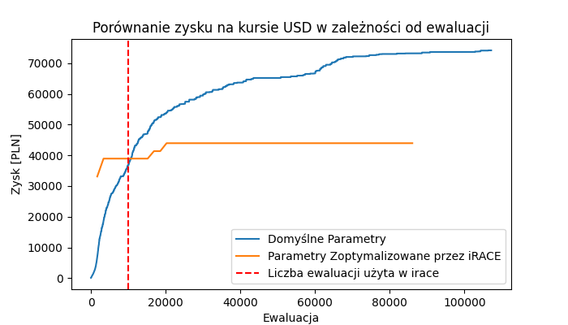

# Raport - etap 6 - 20.05.24

## Metaoptymalizacja na Aresie

Metaoptymalizacja na Aresie okazała się najbardziej czasochłonnym zadaniem w tym projekcie. Największymi trudnościamy były: przygotowanie środowiska do uruchamiania eksperymentów, modyfikacja kodu, aby był kompatybilny z systemem Aresa oraz pisanie, testowanie i wykonanie skryptów z eksperymentami. Te czynności zajęły pierwszy tydzień pracy.

Kilka razy eksperymenty okazywały się niewypałami, np. przez to, że CMA wyrzucało warningi, które przerywały pracę irace.

Zużywany czas na Aresie okazał się skalować liniowo z liczbą wykorzystywanych rdzeni procesora, przez co używanie większej ich liczby nie musiało dawać lepszych wyników (przyspieszenie w równoległych programach rzadko jest równe liczbie wątków procesora). Mimo to, największe eksperymenty okazały się być znacznie szybsze niż przewidywano.

Pierwszy duży eksperyment miał następujące parametry: 24h, 11 rdzeni, 5k ewaluacji w cma i 2k konfiguracji w irace. Jego czas w kolejce wyniósł około 3 dni, co opóźniło mocno dalsze badania. Czas wykonania natomiast wyniósł jedynie 8.5h, co znacznie wyprzedziło szacowany czas (prawdopodobnie kwestia użycia lepszej partycji).

Drugi (główny, największy) eksperyment miał natomiast parametry: 30h, 31 rdzeni, 10k ewaluacji w cma i 5k konfiguracji w irace. Ten eksperyment również czekał w kolejce 3 dni i zdołał policzyć się ostatniego dnia przed zdaniem sprawozdania. Zajął jedynie 11h, więc mógł zostać oszacowany lepiej, jednak zależało nam na wykonaniu pełnego eksperyentu, a nie mielibyśmy już kolejnej szansy po tym.

Planowany budżet do wykorzystania: około 1200h.
Wykorzystany budżet: około 600h.

## Opracowanie wyników

Domyślne parametetry dla algorytmu CMA-ES:

```
--CMA_active_injected 0
--CMA_cmean 1
--CMA_on 1
--CMA_rankmu 1.0
--CMA_rankone 1.0
--CSA_dampfac 1
--popsize 4 + 3 * np.log(N)
--sigma 10
```

Parametery znalezione przy użyciu Irace:

```
--CMA_active_injected 85.0515
--CMA_cmean -0.6412
--CMA_on -77.8581
--CMA_rankmu 0.6389
--CMA_rankone 0.3362
--CSA_dampfac 6.6756
--popsize 1687
--sigma 8.6406
```

Algorytm był metaoptymalizowany na kursie Dollar/Euro w przedziale 01/01/2023 - 01/01/2024. Wyniki dla parametrów zoptymalizowanych oraz nie wyglądają następująco:

### Domyślne parametry

Uzyskany wynik:

> 1_035_024 USD

Czas trwania:

> 1:25.9 s

Ilość iteracji i ewaluacji

> Iter: 501
> Eval: 10020

Wizualizacja:



### Meta parametery

Uzyskany wynik:

> 1_040_192 USD

Czas trwania:

> 1:19.7 s

Ilość iteracji i ewaluacji

> Iter: 6
> Eval: 10122

Wizualizacja:



### Porównanie wyników

Porównajmy zbieżność dla obu przykładów:



Ponieważ w każdej iteracji dla parametrów z irace wykonywaliśmy więcej ewaluacji, zmapujmy wykres w dziedzine ewaluacji:



(Różnica w miejscu startu lini pomarańczowej i niebieskiej wynika z sposobu logowania danych przez CMA-ES, są one logowane na podstawie iteracji nie nr. ewaluacji)

Jak widać już w pierwszej iteracji, CMA-ES z parametrami Irace znalazł optymalny wynik i nie udało mu się go poprawić. Domyślne parametery, zaczynają z gorszym wynikiem, jednak wygląda na to że w większej ilości ewaluacji, wyprzedzą one parametery irace'owe

### Zwiększenie liczby ewaluacji

Zwiększamy liczbe ewaluacji z 10k do  100k, oraz ustawliśmy timeout na 15min

### Domyślne parametery

Uzyskany wynik:

> 1_073_711 USD

Czas trwania:

> 15:00.00 s

Ilość iteracji i ewaluacji

> Iter: 5357
> Eval: 107140

Wizualizacja:



### Meta parametery

Uzyskany wynik:

> 1_038_936 USD

Czas trwania:

> 13:13.6 s

Ilość iteracji i ewaluacji

> Iter: 51
> Eval: 86037

> Termination on tolfunhist=1e-12

Wizualizacja:



### Porównanie wyników

Porównajmy zbieżność dla obu przykładów:



Dodajmy do wykresu linie wyznaczającą liczbę 10k ewaluacji użytych w irace:



Jak widać domyślne parametery okazują się być dużo skuteczniejsze niż parametery zoptymalizowane przez irace. Widzimy także wpływ wybranej liczby ewaluacji do trenowania irace na uzyskany wynik.